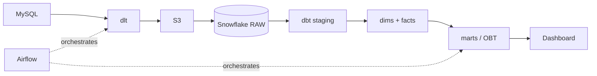

# Architecture (Task 59)
Draw the diagram in Excalidraw or Mermaid and export to images/architecture.png.

```mermaid
flowchart LR
  MySQL --> dlt --> S3 --> RAW[(Snowflake RAW)]
  RAW --> STG[dbt staging] --> DIM[dims + facts] --> MART[marts / OBT] --> BI[Dashboard]
  Airflow -. orchestrates .-> dlt & MART
```
